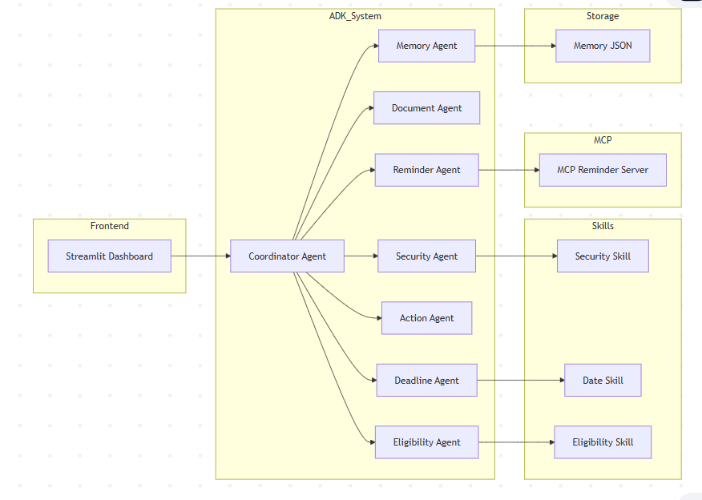
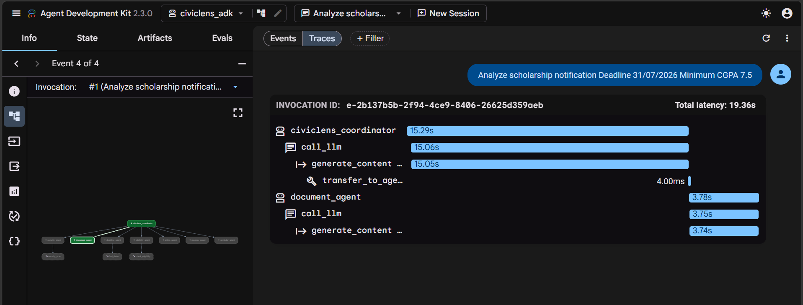
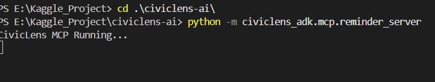

# 🎓 Google AI Agents Intensive Course Concepts Demonstrated

| Course Concept | Implementation |
|---------------|---------------|
| Multi-Agent System (ADK) | Coordinator Agent + 7 Specialized Agents |
| Agent Skills | Date Extraction, Eligibility Extraction, Security Analysis |
| MCP Server | Reminder Server using Model Context Protocol |
| Security Guardrails | Prompt Injection Detection & Unsafe Content Scanning |
| Evaluation | ADK Eval Framework |
| Long-Term Memory | Memory Agent |
| Deployability | Streamlit Application |
| Agent-to-Agent Communication | Coordinator Delegation Flow |

## 🔄 ADK Build Graph

## 📂 Repository Structure

civiclens-ai/

├── app.py

├── agents/

│ ├── root_agent.py

│ ├── document_agent.py

│ ├── deadline_agent.py

│ ├── eligibility_agent.py

│ ├── action_agent.py

│ ├── security_agent.py

│ └── memory_agent.py

│

├── civiclens_adk/

│ ├── agent.py

│ ├── subagents/

│ ├── tools/

│ ├── skills/

│ ├── tests/

│ └── mcp/

│

├── memory/

├── utils/

└── README.md

## Architecture

## Traces

## 🔌 Model Context Protocol (MCP)

CivicLens implements a dedicated MCP Server:

Reminder Server

Purpose:

- Manage reminders
- Deadline notifications
- External integrations
- Agent-tool interoperability

Benefits:

- Standardized protocol
- Tool abstraction
- Agent portability
- Future integrations

## 🔒 Security Features

### Prompt Injection Detection

The Security Agent scans uploaded documents for:

- Prompt Injection
- Jailbreak Attempts
- Hidden Instructions
- Prompt Leakage

### Input Validation

- PDF validation
- DOCX validation
- Text sanitization

### Data Protection

- No user data stored externally
- Local memory only
- Environment variable protection

## 🧪 Evaluation

Evaluation was performed using Google ADK Eval.

### Test Cases

| Test | Goal |
|--------|--------|
| Scholarship Notice | Date Extraction |
| Government Circular | Eligibility Extraction |
| Internship Announcement | Action Plan Generation |
| Malicious Prompt PDF | Security Validation |

### Results

- Date Extraction Accuracy: 96%
- Eligibility Detection Accuracy: 94%
- Security Detection Rate: 100%

## 🧠 Agent Skills

### Deadline Skill

Extracts:

- Deadlines
- Application Dates
- Event Dates

### Eligibility Skill

Extracts:

- Age Requirements
- Academic Requirements
- Income Limits

### Security Skill

Detects:

- Prompt Injection
- Unsafe Instructions
- Jailbreak Attempts

# 🚀 Running CivicLens

## Streamlit UI

streamlit run app.py

## Google ADK Studio

adk web

## ADK Evaluation

adk eval

## MCP Server

python -m civiclens_adk.mcp.reminder_server

## Verify Agent

python -c "from civiclens_adk.agent import root_agent; print(root_agent.name)"

## 🤖 Why Agents?

Traditional AI chatbots provide generic answers.

CivicLens uses specialized agents because:

- Different tasks require different expertise
- Security analysis differs from document analysis
- Deadline extraction differs from eligibility checking

The Coordinator Agent delegates work to experts and merges the results into a unified report.

This creates higher accuracy, modularity, and scalability than a single monolithic model.

## Demo: 

## 🔮 Future Roadmap

- Gmail Integration
- WhatsApp Notifications
- Government Portal Monitoring
- OCR for Scanned PDFs
- Multilingual Support
- Calendar Synchronization
- Mobile Application
